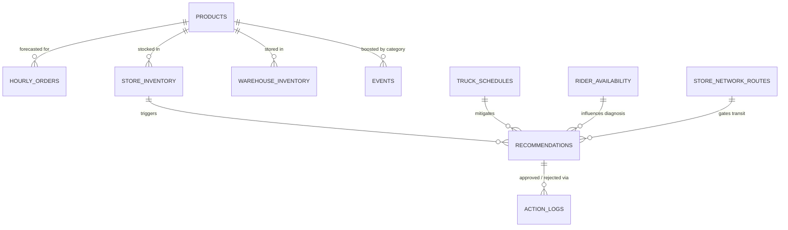

# PulseStock AI — Data Schema Contract
**Cypher 2026 · Challenge 6: Before the Match Starts (Zipcart)**  
**Version:** 1.0.0 · **Target DB:** SQLite 3 (`pulsestock.db`)

---

## 1. Overview & Architecture

PulseStock AI ingests **seven core CSV datasets** mirroring dark-store quick commerce operations, and manages **two dynamic operational tables** (`recommendations` and `action_logs`) for live human-in-the-loop decision intelligence.



---

## 2. Core CSV Data Schemas (Input Files)

All CSV files live in `/data/` and are loaded into SQLite on system startup or reset.

### CSV 1: `products.csv`
Defines SKU details, unit economics for margin calculation, and fallback substitutes.

| Column | Type | Nullable | Example | Description |
|---|---|---|---|---|
| `sku_id` | `VARCHAR(32)` | NO (PK) | `"SKU_COLD_DRINK_750ML"` | Unique SKU identifier |
| `name` | `VARCHAR(128)` | NO | `"FizzCola 750ml"` | Display product name |
| `category_id` | `VARCHAR(32)` | NO | `"CAT_BEVERAGES"` | Category (cold drinks, snacks, dairy) |
| `unit_price` | `FLOAT` | NO | `45.00` | Retail sale price (INR) |
| `unit_cost` | `FLOAT` | NO | `31.50` | Procurement cost (INR) |
| `unit_margin` | `FLOAT` | NO | `13.50` | `unit_price - unit_cost` (profit per unit) |
| `pack_size_units` | `INTEGER` | NO | `1` | Packing unit |
| `substitute_sku_id`| `VARCHAR(32)` | YES (FK) | `"SKU_COLD_DRINK_500ML"` | Substitute product for demand shaping |

---

### CSV 2: `hourly_orders.csv`
Historical baseline demand by store, SKU, day-of-week, and hour.

| Column | Type | Nullable | Example | Description |
|---|---|---|---|---|
| `id` | `INTEGER` | NO (PK) | `1024` | Auto-increment surrogate key |
| `store_id` | `VARCHAR(32)` | NO | `"STORE_007"` | Dark store identifier |
| `sku_id` | `VARCHAR(32)` | NO (FK) | `"SKU_COLD_DRINK_750ML"` | SKU code |
| `day_of_week` | `VARCHAR(16)` | NO | `"Friday"` | Day name (Monday–Sunday) |
| `hour` | `INTEGER` | NO | `17` | Hour of day (0 to 23) |
| `baseline_demand` | `FLOAT` | NO | `3.0` | Expected baseline units demanded per hour |
| `std_dev` | `FLOAT` | NO | `0.45` | Demand variance metric |

---

### CSV 3: `store_inventory.csv`
Live inventory levels, assigned shelf slot identifiers, and physical slot capacities.

| Column | Type | Nullable | Example | Description |
|---|---|---|---|---|
| `store_id` | `VARCHAR(32)` | NO | `"STORE_007"` | Dark store identifier |
| `sku_id` | `VARCHAR(32)` | NO (FK) | `"SKU_COLD_DRINK_750ML"` | SKU code |
| `current_stock` | `INTEGER` | NO | `14` | Bottles/units physically on shelf |
| `shelf_slot_id` | `VARCHAR(32)` | NO | `"SLOT_BEV_04"` | Physical rack/bin slot identifier |
| `slot_capacity` | `INTEGER` | NO | `25` | Hard limit of units the slot physically fits |
| `reserved_stock`| `INTEGER` | NO | `0` | Units allocated to pending picker baskets |
| `last_updated_at`| `VARCHAR(32)`| NO | `"2026-10-10T17:00:00"` | Timestamp of last stock sync |

*Composite Primary Key: (`store_id`, `sku_id`)*

---

### CSV 4: `warehouse_inventory.csv`
Upstream central mother-warehouse inventory for early trucks and emergency replenishment.

| Column | Type | Nullable | Example | Description |
|---|---|---|---|---|
| `warehouse_id` | `VARCHAR(32)` | NO | `"WH_CENTRAL_01"` | Central distribution warehouse ID |
| `sku_id` | `VARCHAR(32)` | NO (FK) | `"SKU_COLD_DRINK_750ML"` | SKU code |
| `available_stock`| `INTEGER` | NO | `3500` | Unreserved stock ready to load on trucks |
| `reserved_stock` | `INTEGER` | NO | `450` | Units already assigned to loading manifests |
| `lead_time_minutes`| `INTEGER` | NO | `35` | Loading & dispatch prep time |

*Composite Primary Key: (`warehouse_id`, `sku_id`)*

---

### CSV 5: `truck_schedules.csv`
Scheduled replenishment truck dispatches, route targets, and carrying capacities.

| Column | Type | Nullable | Example | Description |
|---|---|---|---|---|
| `truck_id` | `VARCHAR(32)` | NO (PK) | `"TRUCK_NORTH_101"` | Unique vehicle/dispatch run ID |
| `origin_id` | `VARCHAR(32)` | NO | `"WH_CENTRAL_01"` | Warehouse or hub origin |
| `destination_store_id` | `VARCHAR(32)` | NO | `"STORE_007"` | Target dark store |
| `scheduled_departure` | `VARCHAR(32)` | NO | `"2026-10-10T20:15:00"` | Planned departure |
| `scheduled_arrival` | `VARCHAR(32)` | NO | `"2026-10-10T21:00:00"` | Expected dock arrival time |
| `max_capacity_units` | `INTEGER` | NO | `400` | Total units vehicle can carry |
| `allocated_units` | `INTEGER` | NO | `260` | Units already manifest-booked |
| `status` | `VARCHAR(20)` | NO | `"SCHEDULED"` | `"SCHEDULED" \| "EN_ROUTE" \| "ARRIVED" \| "DELAYED"` |

---

### CSV 6: `rider_availability.csv`
Active delivery fleet per store and hour. Critical for diagnosing rider vs stock bottlenecks.

| Column | Type | Nullable | Example | Description |
|---|---|---|---|---|
| `store_id` | `VARCHAR(32)` | NO | `"STORE_007"` | Dark store identifier |
| `hour` | `INTEGER` | NO | `19` | Operating hour (0-23) |
| `active_riders` | `INTEGER` | NO | `3` | On-duty delivery riders logged in |
| `orders_per_rider_hour` | `FLOAT` | NO | `2.5` | Throughput constant (average 2.5 drops/hr) |
| `max_hourly_dispatches` | `FLOAT` | NO | `7.5` | `active_riders * orders_per_rider_hour` |

*Composite Primary Key: (`store_id`, `hour`)*

---

### CSV 7: `events.csv`
Macro demand-shaping events (cricket matches, rainstorm, festivals) with category multipliers.

| Column | Type | Nullable | Example | Description |
|---|---|---|---|---|
| `event_id` | `VARCHAR(32)` | NO (PK) | `"EVT_IND_VS_PAK_FINAL"` | Unique event identifier |
| `event_name` | `VARCHAR(128)` | NO | `"Ind vs Pak T20 Final"` | Display name |
| `category_id` | `VARCHAR(32)` | NO | `"CAT_BEVERAGES"` | Affected product category |
| `start_time` | `VARCHAR(32)` | NO | `"2026-10-10T19:30:00"` | Event start |
| `end_time` | `VARCHAR(32)` | NO | `"2026-10-10T23:30:00"` | Event end |
| `uplift_multiplier` | `FLOAT` | NO | `3.0` | Demand multiplier (e.g., 3.0x normal) |
| `pre_event_buffer_hours`| `INTEGER` | NO | `2` | Ramping hours before official start |
| `affected_stores` | `VARCHAR(256)` | NO | `"STORE_007,STORE_009,STORE_012"` | Comma-separated or `"ALL"` |

---

### Auxiliary Dataset: `store_network_routes.csv`
Store-to-store travel matrix used by the simulated traffic engine for transfer ETA validation.

| Column | Type | Nullable | Example | Description |
|---|---|---|---|---|
| `route_id` | `VARCHAR(32)` | NO (PK) | `"ROUTE_S09_S07"` | Unique route key |
| `origin_store_id` | `VARCHAR(32)` | NO | `"STORE_009"` | Donor store |
| `destination_store_id` | `VARCHAR(32)` | NO | `"STORE_007"` | Recipient store |
| `distance_km` | `FLOAT` | NO | `4.2` | Road distance |
| `base_travel_minutes`| `FLOAT` | NO | `18.0` | Off-peak driving time |
| `loading_minutes` | `FLOAT` | NO | `10.0` | Pack & dock loading buffer |
| `traffic_factor` | `FLOAT` | NO | `1.4` | Live multiplier (1.0 off-peak, 1.8 peak) |
| `is_blocked` | `BOOLEAN` | NO | `0` | Simulated road blockage trigger (0 or 1) |

---

## 3. SQLite Application State Tables

These tables are created directly in SQLite by the FastAPI backend to store decisions and audit logs.

### Table: `recommendations`
Stores generated prescriptive alerts.

```sql
CREATE TABLE IF NOT EXISTS recommendations (
    alert_id VARCHAR(64) PRIMARY KEY,
    store_id VARCHAR(32) NOT NULL,
    sku_id VARCHAR(32) NOT NULL,
    created_at TIMESTAMP DEFAULT CURRENT_TIMESTAMP,
    status VARCHAR(20) DEFAULT 'PENDING',  -- 'PENDING', 'APPROVED', 'REJECTED', 'SUPERSEDED'
    
    -- Bottleneck Diagnosis
    bottleneck_type VARCHAR(32) NOT NULL, -- 'STOCK_DEFICIT', 'SHELF_LIMIT', 'INBOUND_DELAY', 'RIDER_SHORTAGE'
    urgency_level VARCHAR(16) NOT NULL,   -- 'CRITICAL', 'HIGH', 'MEDIUM', 'HEALTHY'
    scope_mode VARCHAR(16) DEFAULT 'LOCAL', -- 'LOCAL' or 'CITY_WIDE_SURGE'
    
    -- Timings & Exposure
    current_stock INTEGER NOT NULL,
    stockout_time TIMESTAMP NULL,
    next_truck_time TIMESTAMP NULL,
    exposure_minutes INTEGER DEFAULT 0,
    projected_lost_units INTEGER DEFAULT 0,
    net_margin_protected FLOAT DEFAULT 0.0,
    
    -- Actions (stored as structured JSON strings)
    primary_action_type VARCHAR(32) NOT NULL, -- 'TRANSFER', 'EARLY_TRUCK', 'SHELF_SWAP', 'COMBINED_SWAP_TRANSFER', 'RIDER_ESCALATION', 'WAIT'
    primary_action_payload TEXT NOT NULL,     -- JSON: quantity, donor_id, swap_sku, eta_minutes, cost
    fallback_action_type VARCHAR(32) NULL,
    fallback_action_payload TEXT NULL,
    
    -- Agent Explainability
    explanation_summary TEXT NOT NULL,
    explanation_markdown TEXT NOT NULL,
    
    FOREIGN KEY (sku_id) REFERENCES products(sku_id)
);
```

### Table: `action_logs`
Immutable audit log recording every human manager interaction (Approval, Edit, Rejection) and trigger.

```sql
CREATE TABLE IF NOT EXISTS action_logs (
    log_id INTEGER PRIMARY KEY AUTOINCREMENT,
    alert_id VARCHAR(64) NOT NULL,
    store_id VARCHAR(32) NOT NULL,
    sku_id VARCHAR(32) NOT NULL,
    timestamp TIMESTAMP DEFAULT CURRENT_TIMESTAMP,
    manager_id VARCHAR(64) NOT NULL,
    decision VARCHAR(20) NOT NULL,            -- 'APPROVED', 'EDITED_AND_APPROVED', 'REJECTED'
    executed_action_type VARCHAR(32) NOT NULL,
    final_quantity INTEGER DEFAULT 0,
    manager_notes TEXT NULL,
    re_plan_triggered BOOLEAN DEFAULT 0,
    execution_status VARCHAR(20) DEFAULT 'SIMULATED_SUCCESS',
    
    FOREIGN KEY (alert_id) REFERENCES recommendations(alert_id)
);
```

---

## 4. SQLite Initialization Script (`db_init.py`)

A beginner-friendly script will be located at `backend/database.py`:
- Ingests all 7 CSV files from `backend/data/*.csv`.
- Creates SQLite indices on `(store_id, sku_id)` for ultra-fast dashboard queries (< 5ms).
- Provides pre-seeded realistic hackathon demo data (e.g. Store 7 750ml Cold Drink scenario).
