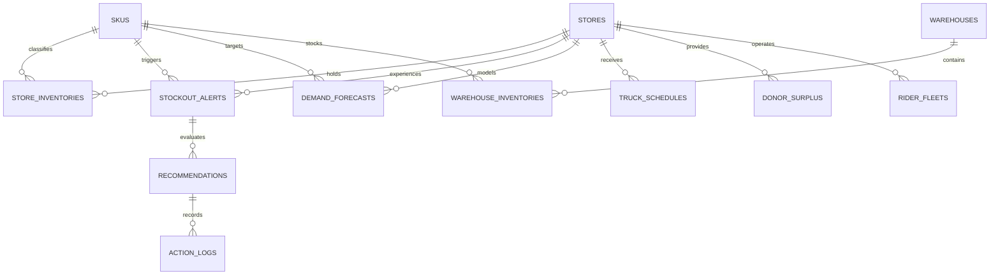

# PulseStock AI - Data Schema Specification

**Database Engine:** SQLite 3  
**ORM Compatibility:** SQLAlchemy 2.0 / SQLModel / FastAPI  
**Target File:** `backend/pulsestock.db`  

---

## 1. Entity Relationship (ER) Diagram



---

## 2. Table Definitions

### 2.1 `stores`
Master table containing store locations and zone definitions.

| Column Name | Data Type | Constraints | Description & Example |
| :--- | :--- | :--- | :--- |
| `store_id` | TEXT | PRIMARY KEY | Unique store identifier (`STORE_007`) |
| `store_name` | TEXT | NOT NULL | Human-readable name (`Store 7 - Koramangala Tech Park`) |
| `location_zone` | TEXT | NOT NULL | Operational zone (`Koramangala Zone 4`) |
| `stadium_proximity_km` | REAL | DEFAULT 0.0 | Distance to nearest cricket stadium in km (`1.4`) |
| `created_at` | DATETIME | DEFAULT CURRENT_TIMESTAMP | ISO Timestamp |

---

### 2.2 `skus`
Master table for Stock Keeping Units (SKUs).

| Column Name | Data Type | Constraints | Description & Example |
| :--- | :--- | :--- | :--- |
| `sku_id` | TEXT | PRIMARY KEY | Unique SKU identifier (`SKU_COLD_DRINK_750ML`) |
| `sku_name` | TEXT | NOT NULL | Full product title (`Sparkling Cola 750ml`) |
| `category` | TEXT | NOT NULL | Product category (`Cold Beverages`) |
| `unit_cost_price_inr` | REAL | NOT NULL | Wholesale purchase cost in INR (`60.0`) |
| `unit_selling_price_inr` | REAL | NOT NULL | Retail selling price in INR (`90.0`) |
| `created_at` | DATETIME | DEFAULT CURRENT_TIMESTAMP | ISO Timestamp |

---

### 2.3 `store_inventories`
Stores current physical inventory split between front shelf and backroom.

| Column Name | Data Type | Constraints | Description & Example |
| :--- | :--- | :--- | :--- |
| `id` | INTEGER | PRIMARY KEY AUTOINCREMENT | Surrogate key |
| `store_id` | TEXT | NOT NULL, FK(`stores.store_id`) | Store identifier (`STORE_007`) |
| `sku_id` | TEXT | NOT NULL, FK(`skus.sku_id`) | SKU identifier (`SKU_COLD_DRINK_750ML`) |
| `shelf_stock_units` | INTEGER | NOT NULL, CHECK >= 0 | Current quantity on customer shelf (`35`) |
| `shelf_capacity_units` | INTEGER | NOT NULL, CHECK > 0 | Maximum physical shelf slot capacity (`40`) |
| `backroom_stock_units` | INTEGER | NOT NULL, CHECK >= 0 | Current quantity in store backroom (`20`) |
| `safety_stock_threshold_units` | INTEGER | NOT NULL | Minimum safety buffer (`25`) |
| `reorder_point_units` | INTEGER | NOT NULL | Reorder trigger threshold (`50`) |
| `updated_at` | DATETIME | DEFAULT CURRENT_TIMESTAMP | Last updated timestamp |

---

### 2.4 `external_events`
Active external demand drivers influencing store zones.

| Column Name | Data Type | Constraints | Description & Example |
| :--- | :--- | :--- | :--- |
| `event_id` | TEXT | PRIMARY KEY | Unique event identifier (`EVT_CRICKET_20261009`) |
| `event_type` | TEXT | CHECK IN ('CRICKET','RAIN','FESTIVAL') | Event type category |
| `title` | TEXT | NOT NULL | Title (`India vs Pakistan T20`) |
| `store_id` | TEXT | FK(`stores.store_id`) | Target store affected |
| `multiplier` | REAL | NOT NULL, DEFAULT 1.0 | Demand multiplier factor (`2.5`) |
| `precipitation_mm_hr` | REAL | DEFAULT 0.0 | Rain intensity in mm/hr if rain (`22.5`) |
| `is_active` | INTEGER | DEFAULT 1 (BOOLEAN) | Active flag (`1` = True, `0` = False) |
| `start_time` | DATETIME | NOT NULL | Event start time |
| `end_time` | DATETIME | NOT NULL | Event end time |

---

### 2.5 `stockout_alerts`
Generated 4-hour stockout alerts evaluated by the decision engine.

| Column Name | Data Type | Constraints | Description & Example |
| :--- | :--- | :--- | :--- |
| `alert_id` | TEXT | PRIMARY KEY | Unique alert ID (`ALT_20261009_007_01`) |
| `store_id` | TEXT | NOT NULL, FK(`stores.store_id`) | Store experiencing risk (`STORE_007`) |
| `sku_id` | TEXT | NOT NULL, FK(`skus.sku_id`) | SKU experiencing risk (`SKU_COLD_DRINK_750ML`) |
| `severity` | TEXT | CHECK IN ('CRITICAL','HIGH','MEDIUM','LOW') | Severity level (`CRITICAL`) |
| `current_total_stock` | INTEGER | NOT NULL | Total stock at alert generation (`55`) |
| `projected_hourly_demand` | INTEGER | NOT NULL | Projected demand in peak hour (`65`) |
| `stockout_probability` | REAL | NOT NULL | Probability between 0.0 and 1.0 (`0.96`) |
| `minutes_until_stockout` | INTEGER | NULLABLE | Estimated minutes to 0 stock (`42`) |
| `estimated_stockout_time` | DATETIME | NULLABLE | Estimated stockout timestamp |
| `status` | TEXT | DEFAULT 'PENDING' | Status (`PENDING`, `RESOLVED`, `EXPIRED`) |
| `created_at` | DATETIME | DEFAULT CURRENT_TIMESTAMP | Alert creation timestamp |

---

### 2.6 `recommendations`
AI Engine recommendation options for an alert.

| Column Name | Data Type | Constraints | Description & Example |
| :--- | :--- | :--- | :--- |
| `recommendation_id` | TEXT | PRIMARY KEY | Unique recommendation ID (`REC_007_TRF_01`) |
| `alert_id` | TEXT | NOT NULL, FK(`stockout_alerts.alert_id`) | Parent alert ID |
| `option_type` | TEXT | CHECK IN ('TRANSFER','EARLIER_TRUCK','SHELF_SWAP','WAIT') | Resolution strategy |
| `rank` | INTEGER | NOT NULL | Engine ranking (`1`, `2`, `3`, `4`) |
| `title` | TEXT | NOT NULL | Short summary (`Inter-Store Transfer from Store 3`) |
| `confidence_score` | REAL | NOT NULL | Confidence score `0.0` - `1.0` (`0.94`) |
| `stockout_prevented` | INTEGER | NOT NULL | Boolean `1` or `0` (`1`) |
| `action_params_json` | TEXT | NOT NULL | JSON string with transfer details |
| `execution_cost_inr` | REAL | NOT NULL | Cost to execute action in INR (`150.0`) |
| `revenue_saved_inr` | REAL | NOT NULL | Estimated saved revenue in INR (`4500.0`) |
| `is_recommended` | INTEGER | NOT NULL | Boolean `1` for top recommendation |
| `created_at` | DATETIME | DEFAULT CURRENT_TIMESTAMP | Timestamp |

---

### 2.7 `action_logs`
Audit log of manager approvals, rejections, and execution results.

| Column Name | Data Type | Constraints | Description & Example |
| :--- | :--- | :--- | :--- |
| `action_id` | TEXT | PRIMARY KEY | Action identifier (`ACT_20261009_8812`) |
| `alert_id` | TEXT | NOT NULL | Associated alert ID |
| `recommendation_id` | TEXT | NOT NULL | Associated recommendation ID |
| `store_id` | TEXT | NOT NULL | Associated store ID |
| `sku_id` | TEXT | NOT NULL | Associated SKU ID |
| `action_type` | TEXT | NOT NULL | Strategy type (`TRANSFER`) |
| `status` | TEXT | CHECK IN ('APPROVED','REJECTED','EXECUTED') | Outcome status (`APPROVED`) |
| `manager_id` | TEXT | NOT NULL | Manager identifier (`MGR_KORAMANGALA_07`) |
| `notes` | TEXT | NULLABLE | Manager comments |
| `cost_inr` | REAL | NOT NULL | Execution cost in INR (`150.0`) |
| `created_at` | DATETIME | DEFAULT CURRENT_TIMESTAMP | Log timestamp |

---

## 3. SQLite Schema DDL Script

Backend developers can directly copy and run this DDL script to create the SQLite tables:

```sql
-- Disable foreign key check during creation
PRAGMA foreign_keys = ON;

CREATE TABLE IF NOT EXISTS stores (
    store_id TEXT PRIMARY KEY,
    store_name TEXT NOT NULL,
    location_zone TEXT NOT NULL,
    stadium_proximity_km REAL DEFAULT 0.0,
    created_at DATETIME DEFAULT CURRENT_TIMESTAMP
);

CREATE TABLE IF NOT EXISTS skus (
    sku_id TEXT PRIMARY KEY,
    sku_name TEXT NOT NULL,
    category TEXT NOT NULL,
    unit_cost_price_inr REAL NOT NULL,
    unit_selling_price_inr REAL NOT NULL,
    created_at DATETIME DEFAULT CURRENT_TIMESTAMP
);

CREATE TABLE IF NOT EXISTS store_inventories (
    id INTEGER PRIMARY KEY AUTOINCREMENT,
    store_id TEXT NOT NULL FOREIGN KEY REFERENCES stores(store_id),
    sku_id TEXT NOT NULL FOREIGN KEY REFERENCES skus(sku_id),
    shelf_stock_units INTEGER NOT NULL CHECK (shelf_stock_units >= 0),
    shelf_capacity_units INTEGER NOT NULL CHECK (shelf_capacity_units > 0),
    backroom_stock_units INTEGER NOT NULL CHECK (backroom_stock_units >= 0),
    safety_stock_threshold_units INTEGER NOT NULL,
    reorder_point_units INTEGER NOT NULL,
    updated_at DATETIME DEFAULT CURRENT_TIMESTAMP
);

CREATE TABLE IF NOT EXISTS external_events (
    event_id TEXT PRIMARY KEY,
    event_type TEXT CHECK (event_type IN ('CRICKET','RAIN','FESTIVAL')),
    title TEXT NOT NULL,
    store_id TEXT FOREIGN KEY REFERENCES stores(store_id),
    multiplier REAL NOT NULL DEFAULT 1.0,
    precipitation_mm_hr REAL DEFAULT 0.0,
    is_active INTEGER DEFAULT 1,
    start_time DATETIME NOT NULL,
    end_time DATETIME NOT NULL
);

CREATE TABLE IF NOT EXISTS stockout_alerts (
    alert_id TEXT PRIMARY KEY,
    store_id TEXT NOT NULL FOREIGN KEY REFERENCES stores(store_id),
    sku_id TEXT NOT NULL FOREIGN KEY REFERENCES skus(sku_id),
    severity TEXT CHECK (severity IN ('CRITICAL','HIGH','MEDIUM','LOW')),
    current_total_stock INTEGER NOT NULL,
    projected_hourly_demand INTEGER NOT NULL,
    stockout_probability REAL NOT NULL,
    minutes_until_stockout INTEGER,
    estimated_stockout_time DATETIME,
    status TEXT DEFAULT 'PENDING',
    created_at DATETIME DEFAULT CURRENT_TIMESTAMP
);

CREATE TABLE IF NOT EXISTS recommendations (
    recommendation_id TEXT PRIMARY KEY,
    alert_id TEXT NOT NULL FOREIGN KEY REFERENCES stockout_alerts(alert_id),
    option_type TEXT CHECK (option_type IN ('TRANSFER','EARLIER_TRUCK','SHELF_SWAP','WAIT')),
    rank INTEGER NOT NULL,
    title TEXT NOT NULL,
    confidence_score REAL NOT NULL,
    stockout_prevented INTEGER NOT NULL,
    action_params_json TEXT NOT NULL,
    execution_cost_inr REAL NOT NULL,
    revenue_saved_inr REAL NOT NULL,
    is_recommended INTEGER NOT NULL,
    created_at DATETIME DEFAULT CURRENT_TIMESTAMP
);

CREATE TABLE IF NOT EXISTS action_logs (
    action_id TEXT PRIMARY KEY,
    alert_id TEXT NOT NULL,
    recommendation_id TEXT NOT NULL,
    store_id TEXT NOT NULL,
    sku_id TEXT NOT NULL,
    action_type TEXT NOT NULL,
    status TEXT CHECK (status IN ('APPROVED','REJECTED','EXECUTED')),
    manager_id TEXT NOT NULL,
    notes TEXT,
    cost_inr REAL NOT NULL,
    created_at DATETIME DEFAULT CURRENT_TIMESTAMP
);
```
